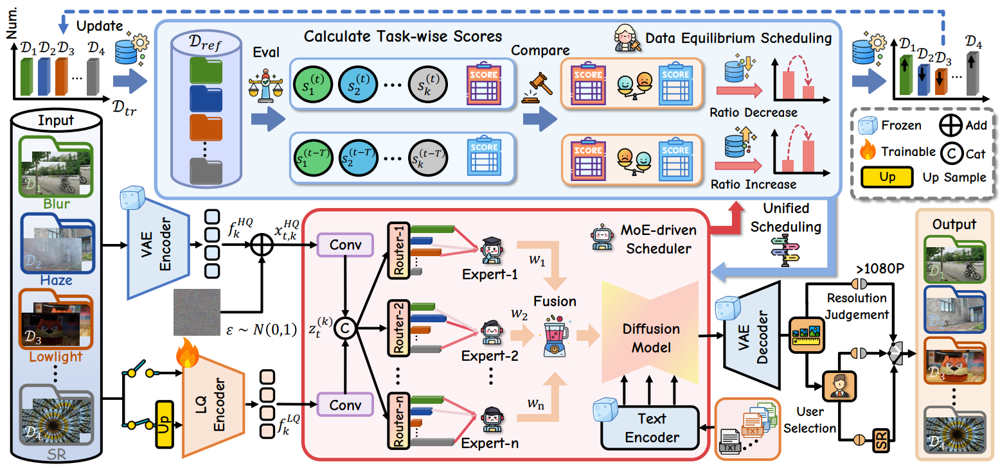

<p align="center">
  
</p>

### FoundIR-v2: Optimizing Pre-Training Data Mixtures for Image Restoration Foundation Model

> [[Paper](https://arxiv.org/abs/2512.09282)] &emsp; [Supplemental Material] &emsp; [中文版介绍]

> [Xiang Chen](https://cschenxiang.github.io/), [Jinshan Pan](https://jspan.github.io/), [Jiangxin Dong](https://scholar.google.com/citations?user=ruebFVEAAAAJ&hl=zh-CN&oi=ao), [Jian Yang](https://scholar.google.com/citations?hl=en&user=6CIDtZQAAAAJ), [Jinhui Tang](https://scholar.google.com/citations?user=ByBLlEwAAAAJ&hl=zh-CN)  <br>
> Nanjing University of Science and Technology, Nanjing Forestry University


Welcome to visit our website (底层视觉社区平台&基础科研平台) for low-level vision: https://lowlevelcv.com/

---
<p align="center">
  
</p>

*Building upon FoundIR (ICCV 2025), which investigates the effects of training **data scaling laws** in image restoration foundation models, FoundIR-v2 further uncovers the **data mixing laws** that govern how mixture proportions influence all-in-one image restoration.*

---

### 🚩 **New Features/Updates**
- ✅ December 11, 2025. Release [paper](https://arxiv.org/abs/2512.09282).


### Citation
If this work is helpful for your research, please consider citing the following BibTeX entry.
```
@article{foundirv2,
      title={FoundIR-v2: Optimizing Pre-Training Data Mixtures for Image Restoration Foundation Model},
      author={Chen, Xiang and Pan, Jinshan and Dong, Jiangxin and Yang, Jian and Tang, Jinhui},
      journal={arXiv preprint arXiv:2511.18537},
      year={2025}
}
 ```

### Contact
If you have any questions, please feel free to reach us out at <a href="mailto:chenxiang@njust.edu.cn">chenxiang@njust.edu.cn</a>.

